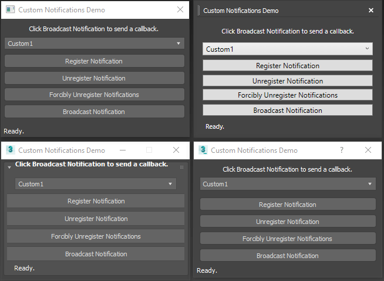

### Autodesk 3ds Max Custom Callback Notification Examples

This repository demonstrates how to hook onto and call custom callback notifications in Autodesk 3ds Max 2019. This repository comes with [this accompanying blogpost](https://wesleyhill.co.uk/p/custom-callback-notifcations-in-3ds-max/).

### Requirements

+ [**Autodesk 3ds Max 2019**](https://www.autodesk.co.uk/products/3ds-max/free-trial) and higher.
  + Autodesk 3ds Max 2019 (and higher) **SDK** (Comes with the installer)
+ [**Microsoft Visual Studio 2017/2019 IDE**](<https://visualstudio.microsoft.com/vs/community/>)
+ [**Windows 10**](https://www.microsoft.com/en-gb/software-download/windows10)

### Usage

Each folder contains a language implementation of the example with a README on how to run the examples.

[`c++`](https://github.com/hako/3dsMax-CustomNotifications/tree/master/c%2B%2B) (top left)

[`csharp`](https://github.com/hako/3dsMax-CustomNotifications/tree/master/csharp) (top right)

[`maxscript`](https://github.com/hako/3dsMax-CustomNotifications/tree/master/maxscript) (bottom left)

[`python`](https://github.com/hako/3dsMax-CustomNotifications/tree/master/python) (bottom right)

This has been tested to be working on **Windows 10**.

### LICENSE

Apache License 2.0

See [LICENSE](https://github.com/hako/3dsMax-CustomNotifications/tree/master/LICENSE) for the full license text.